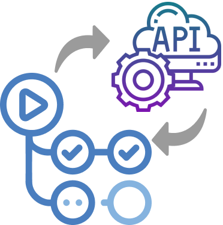

[<p align='center'></p>](https://github.com/andrii-bodnar/crowdin-request-action)

# Crowdin Request Action [](https://twitter.com/intent/tweet?url=https%3A%2F%2Fgithub.com%2Fandrii-bodnar%2Fcrowdin-request-action&text=A%20GitHub%20Action%20to%20send%20arbitrary%20requests%20to%20Crowdin%27s%20REST%20API)&nbsp;[](https://github.com/andrii-bodnar/crowdin-request-action/stargazers)

> A GitHub Action to send arbitrary requests to Crowdin's REST API

<div align="center">

[**`Examples`**](/EXAMPLES.md) &nbsp;|&nbsp;
[**`Crowdin API`**](https://developer.crowdin.com/api/v2/) &nbsp;|&nbsp;
[**`Crowdin Enterprise API`**](https://developer.crowdin.com/enterprise/api/v2/)

[](https://github.com/andrii-bodnar/crowdin-request-action/actions/workflows/check-dist.yml)
[](https://github.com/andrii-bodnar/crowdin-request-action/actions/workflows/test.yml)
[](https://github.com/andrii-bodnar/crowdin-request-action/actions/workflows/e2eTest.yml)
[](https://codecov.io/gh/andrii-bodnar/crowdin-request-action)

</div>

## Usage

Set up a workflow in *.github/workflows/crowdin-request.yml* (or add a job to your existing workflows).

Read the [Configuring a workflow](https://help.github.com/en/articles/configuring-a-workflow) article for more details on how to create and set up custom workflows.

```yaml
name: Crowdin Request Action

on:
  # When you push to the `main` branch
  push:
    branches: [ main ]
  # And optionally, once every 12 hours
  schedule:
    - cron: '0 */12 * * *' # https://crontab.guru/#0_*/12_*_*_*
  # To manually run this workflow
  workflow_dispatch:

jobs:
  crowdin-request:

    runs-on: ubuntu-latest
    steps:
    - name: Checkout
      uses: actions/checkout@v4

    - name: Make Crowdin Request
      uses: andrii-bodnar/crowdin-request-action@0.3.0
      with:
        route: GET /languages
      env:
        CROWDIN_PERSONAL_TOKEN: ${{ secrets.CROWDIN_PERSONAL_TOKEN }}
        CROWDIN_ORGANIZATION: ${{ secrets.CROWDIN_ORGANIZATION }} # Only for Crowdin Enterprise
```

## Inputs

| Option                 | Required | Type      | Description                                                                                                                                                     |
|------------------------|----------|-----------|-----------------------------------------------------------------------------------------------------------------------------------------------------------------|
| `route`                | `true`   | `string`  | HTTP Verb + path                                                                                                                                                |
| `body`                 | `false`  | `string`  | Request body (for POST, PUT, PATCH methods)                                                                                                                     |
| `query`                | `false`  | `string`  | Query parameters (for GET methods)                                                                                                                              |
| `headers`              | `false`  | `string`  | Request headers                                                                                                                                                 |
| Retry configuration    |          |           |                                                                                                                                                                 |
| `retries`              | `false`  | `number`  | Retries count to be made after receiving an error response                                                                                                      |
| `wait_interval`        | `false`  | `number`  | Wait interval between retries. Default is 1000 ms (1 sec)                                                                                                       |
| `skip_error_codes`     | `false`  | `string`  | Error codes for which the retries shouldn't be applied. Separated by comma                                                                                      |
| `retry_until_finished` | `false`  | `boolean` | Retry the request until the asynchronous action finished (should be used to check the status of the operation, for example, check the translation build status) |

See the [EXAMPLES.md](/EXAMPLES.md) file to check these parameters' usage.

## Outputs

This actions provides the following outputs that can be used by other steps in your workflow:

| Option    | Description                                                   |
|-----------|---------------------------------------------------------------|
| `status`  | Response status code                                          |
| `headers` | Response headers as JSON string with lower cased header names |
| `data`    | Response body as a JSON string                                |

To access deep values of these outputs, check out the [fromJson](https://docs.github.com/en/actions/learn-github-actions/contexts#fromjson) function.

Also, there are a few examples of the outputs' usage in the [EXAMPLES.md](/EXAMPLES.md) file.

## Environment variables

| Variable                 | Required | Description                                                                                            |
|--------------------------|----------|--------------------------------------------------------------------------------------------------------|
| `CROWDIN_PERSONAL_TOKEN` | `true`   | Your Crowdin Personal Access Token. Can be generated in your Account settings                          |
| `CROWDIN_ORGANIZATION`   | `false`  | Your Crowdin Enterprise organization name (for example, `test-org` for `https://test-org.crowdin.com`) |

## Debugging

To see additional debug logs, read the [Enabling debug logging](https://docs.github.com/en/actions/monitoring-and-troubleshooting-workflows/enabling-debug-logging).

## Contributing

If you would like to contribute please read the [Contributing](/CONTRIBUTING.md) guidelines.

## Author

- [Andrii Bodnar](https://github.com/andrii-bodnar/)

## License

<pre>
The Crowdin Request Action is licensed under the MIT License.
See the LICENSE file distributed with this work for additional
information regarding copyright ownership.

Except as contained in the LICENSE file, the name(s) of the above copyright
holders shall not be used in advertising or otherwise to promote the sale,
use or other dealings in this Software without prior written authorization.
</pre>
